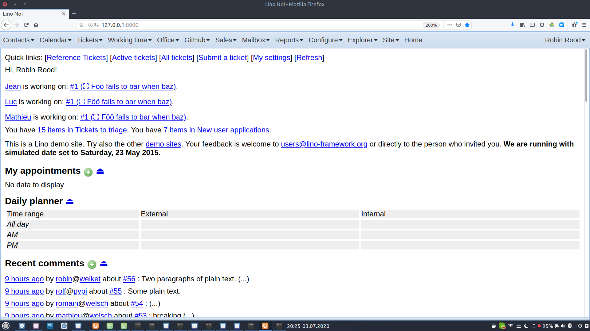
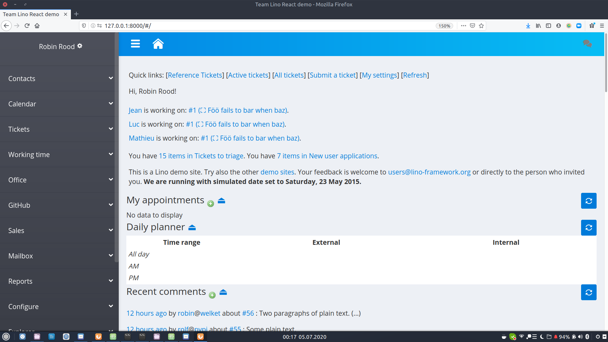

==============================
About the Lino React front end
==============================

The "modern" React front end is an alternative to the "classical" ExtJS front
end. Here are two screenshots of the :mod:`lino_book.projects.team` project,
once with ExtJS and one with React:

How to try it:

- Install some Lino application as explained in :ref:`lino.dev.install`.

- Run ``pip install lino-react``.

- In your :xfile:`settings.py` file, set the :attr:`default_ui`
  attribute to :mod:`lino_react.react`::

    class Site(Site):
        ...
        default_ui = 'lino_react.react'
        ...

- Run :manage:`collectstatic`::

    $ python manage.py collectstatic

- Run a development server::

    $ python manage.py runserver
